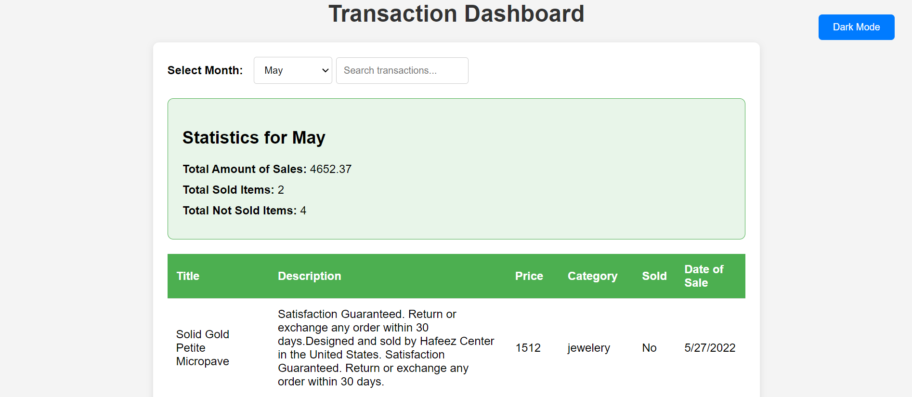

# roxiler-assignment



## Getting Started

### Prerequisites

- Node.js (version 14 or higher)
- MongoDB (local or cloud instance)

### Environment Setup

1. **Clone the repository:**

2. **Set up Backend:**
   - Navigate to the backend folder:
     ```bash
     cd backend
     npm install
     ```
   - Create a `.env` file using the `.env.example` as a template:
     ```bash
     cp .env.example .env
     ```
   - Fill in the `.env` file:
     ```
     PORT=<your_port>
     MONGO_URI=<your_mongo_uri>
     ```

3. **Set up Frontend:**
   - Navigate to the frontend folder:
     ```bash
     cd ../frontend
     npm install
     ```
   - Create a `.env` file using the `.env.example` as a template:
     ```bash
     cp .env.example .env
     ```
   - Fill in the `.env` file:
     ```
     VITE_API_URL='http://localhost:5000/api/transactions'
     ```

### Running the Application

1. **Start the development server:**

   In the backend directory, run:

   ```bash
   npm run dev
   ```

   In the frontend directory, run:

   ```bash
   npm run dev
   ```

### API Documentation

- API documentation: [doc](./public/api.md)
